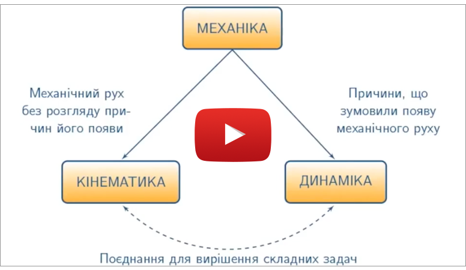

#<p1>Вступ до кінематики</p1>
---------
<p1>Механіка</p1> – наука про механiчний рух матерiальних тiл, рiвновагу тiл, взаємодiю мiж тiлами.

Механіку поділяють на дві складові:
* <p1>Кiнематика</p1> – наука, що розглядає механiчний рух, не цiкавлячись причинами,
що його зумовили.

* <p1>Динамiка</p1> – наука, що розглядає причини виникнення механiчного руху.

  

  
  

  <h1>Remodal</h1>
  

    Flat, responsive, lightweight, fast, easy customizable modal window plugin
    with declarative state notation and hash tracking.
  

  

    Minified version size: ~4kb
  

   
  <a class="remodal-cancel" href="#">Cancel</a>
  <a class="remodal-confirm" href="#">OK</a>

Перед початком розгляду кінематики радимо вам звернути увагу на розділ [Додаток](book/Add/trigonometry/trigonometry.md)

    