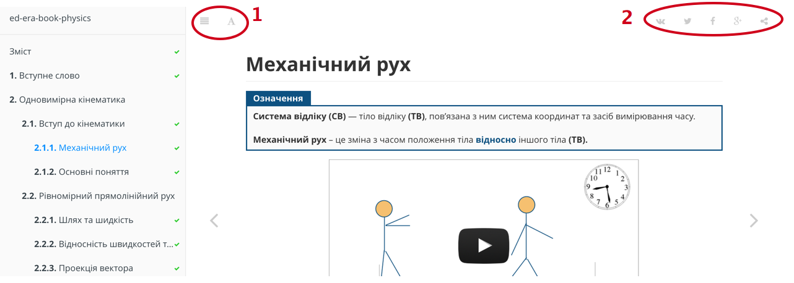

<h1>Загальні відомості</h1>
Інтерактивні книги на проекті складаються з авторського структурованого теоретичного матеріалу, вбудованих відео та запитань, відповіді на які оброблюються миттєво. У запитання іноді вбудовано підказки для того, щоб читач міг розібратися більш глибоко у відповідній темі. Також у книзі часто використовуються стилізовані блоки, такі як «означення», «авторський алгоритм», «задача» тощо. Звертайте на них увагу. 

Означення

<b>Проект EdEra Books</b> — соціальний проект інтерактивної освітньої літератури, створений на базі проекту EdEra (ed-era.com). Проект створюється студентами та випускниками престижних Вишів України та Європи, професіоналами та експертами для української молоді та всіх, хто прагне отримувати якісні знання та навички за допомогою новітніх технологій. 

<h2>Технічні можливості</h2>
Зліва на кожній сторінці ви бачите зміст книги. За допомогою кнопки на панелі (1) зміст можна приховувати та відкривати знову. Також на тій же панелі є кнопка у формі букви «А». Після натискання на неї відкривається меню, у якому можливо змінювати розмір кегля, режим відображення тощо. 

Справа присутня панель (2) з соціальними кнопками. Ви можете поділитися з друзями інформацією з кожної сторінки інтерактивної книги. Така дія може в значній мірі допомогти людям дізнатися про наш проект, а також ви продемонструєте, що ви дуже розумні та читаєте корисну літературу :)

